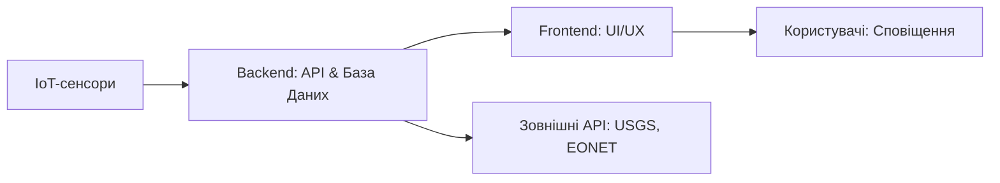

# 🌍 GeoGuard Pro  
**Реальний моніторинг катастроф за допомогою IoT**

> _"Коли стихія наближається — краще знати про це першим."_

**GeoGuard Pro** — це сучасна система моніторингу природних катастроф, що поєднує потужність IoT-сенсорів, зовнішніх API (USGS, EONET) та передових технологій для збору, обробки та візуалізації даних у реальному часі. Від землетрусів до лісових пожеж — ми допомагаємо бути на крок попереду.

---

## 🚀 Можливості

- 🔴 **Моніторинг у реальному часі**  
  Відстеження землетрусів, повеней, вулканів і пожеж за допомогою IoT-сенсорів і глобальних API (USGS, EONET).

- 📈 **Розумне прогнозування**  
  Виявлення критичних подій (наприклад, землетрусів понад 4.0 балів) за допомогою алгоритмів аналізу даних.

- 🗺️ **Інтерактивна панель управління**  
  Живі карти на базі Leaflet.js і графіки з використанням Chart.js для аналітики та відстеження трендів.

- 🔔 **Система сповіщень**  
  Миттєві повідомлення при досягненні критичних порогів — через інтерфейс або сторонні сервіси.

- 📍 **Геолокація користувача**  
  Визначення найближчих подій до користувача з відображенням на карті та обчисленням відстані.

---

## 🛠 Технології

| Шар           | Технології                                     |
|---------------|-------------------------------------------------|
| **IoT**       | Спеціалізовані сенсори, API USGS, EONET         |
| **Backend**   | Node.js, PostgreSQL, REST API                   |
| **Frontend**  | React, Leaflet.js, Chart.js, Tailwind CSS       |
| **Протоколи** | MQTT, HTTPS                                     |

---

## 📡 IoT-Сенсори

GeoGuard Pro використовує спеціалізовані сенсори для моніторингу навколишнього середовища:

- 🏔️ **Сейсмічні сенсори**  
  Вимірюють коливання ґрунту. Інтеграція з USGS API для глобального відстеження землетрусів.

- 🌊 **Сенсори рівня води**  
  Моніторинг річок, озер і дамб для попередження повеней.

- 🌋🔥 **Сенсори вулканічної активності та лісових пожеж**  
  Дані отримуються через API EONET, з відображенням активних вивержень і пожеж у реальному часі.

---

## ⚙️ Архітектура системи

- **IoT-шар**: Збір даних із сенсорів довкілля.  
- **Backend**: Обробка потоків даних, виявлення критичних подій, генерація сповіщень.  
- **Frontend**: Інтерактивна візуалізація, аналітика та керування користувацькими налаштуваннями.

---

## 🎯 Основні компоненти

### 🔗 Backend

- **Збір даних**  
  Інтеграція з IoT-сенсорами та API (USGS, EONET) із фільтрами за часом (3 дні, тиждень, місяць).

- **Аналіз та прогнозування**  
  Виявлення критичних подій згідно з порогами (наприклад, магнітуда > 4.0).

- **Система сповіщень**  
  Автоматичне інформування користувача через інтерфейс або сторонні інтеграції.

### 🎨 Frontend

- **Жива карта**  
  Відображення подій у реальному часі за допомогою Leaflet.js.

- **Аналітика подій**  
  Побудова графіків і статистики з використанням Chart.js.

- **Панель подій**  
  Перелік критичних інцидентів із деталями: магнітуда, локація, час.

- **Налаштування користувача**  
  Локальне збереження порогових значень, геолокації та фільтрів для персоналізованого відображення.

